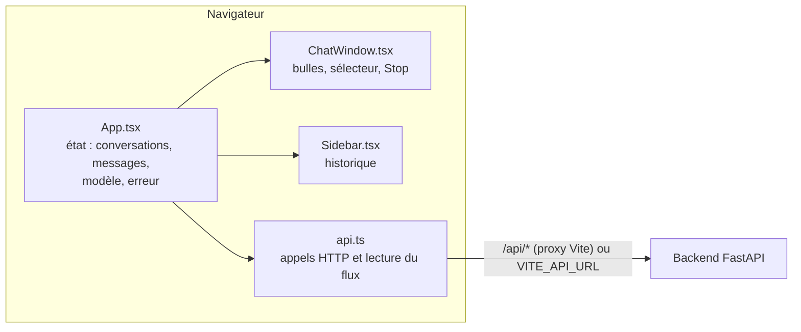

# Study Buddy — Frontend

> Interface web du tuteur IA **Study Buddy** (bases de la cybersécurité et des réseaux) : réponses affichées en direct, choix du modèle, questions de révision et gestion des erreurs.
> Projet du Bootcamp RodiumAI, Module 4.

| | |
|---|---|
| **Application en ligne** | https://elpidio-rodiumai-module4.vercel.app/ |
| **Backend** (dépôt séparé) | https://github.com/elpidio-alex/bootcamp-chatbot-backend |
| **API en ligne** | https://bootcamp-chatbot-backend.onrender.com/ |

> **À savoir :** le backend tourne sur l'offre gratuite de Render. Le premier chargement après une période d'inactivité peut prendre environ une minute, et les conversations sont réinitialisées à chaque redéploiement du serveur.

<!--
## Aperçu

| Réponse en direct | Question de révision | Erreur et « Réessayer » |
|---|---|---|
|  |  |  |
-->

## Sommaire

1. [Fonctionnalités](#fonctionnalités)
2. [Stack technique](#stack-technique)
3. [Installation et lancement](#installation-et-lancement)
4. [Configuration](#configuration)
5. [Architecture](#architecture)
6. [Lecture du flux de réponse](#lecture-du-flux-de-réponse)
7. [Déploiement](#déploiement)
8. [Sécurité](#sécurité)
9. [Limites connues](#limites-connues)
10. [Auteur](#auteur)

## Fonctionnalités

| Fonctionnalité | Détail |
|---|---|
| **Streaming** | La réponse s'affiche au fil de la génération, rendue en Markdown |
| **Choix du modèle** | Sélecteur alimenté par `GET /models` ; le modèle choisi est envoyé avec chaque message |
| **Question de révision** | Les messages de rôle `quiz` ont leur propre bulle (fond jaune, étiquette « Question de révision ») |
| **Notification système** | Affichée comme une pastille centrée, distincte des messages |
| **Bouton Stop** | Interrompt la génération ; le texte déjà reçu reste affiché, avec la mention « Réponse interrompue » |
| **Bouton Réessayer** | Après une erreur, renvoie le même message d'un clic (le serveur n'a rien enregistré, aucun doublon) |
| **Tokens consommés** | Affichés sous chaque réponse reçue (envoyés, générés, total) |
| **Conversations** | Barre latérale avec l'historique, aperçu du premier message et date ; création d'une nouvelle conversation |
| **Thème et mobile** | Thème clair ou sombre selon le système, mise en page adaptée aux petits écrans |

## Stack technique

React 19 · TypeScript · Vite · `react-markdown` · oxlint

## Installation et lancement

**Prérequis :** Node.js 24 (testé avec 24.16.0) et un backend en cours d'exécution (voir le [dépôt backend](https://github.com/elpidio-alex/bootcamp-chatbot-backend)).

```bash
git clone https://github.com/elpidio-alex/bootcamp-chatbot-frontend.git
cd bootcamp-chatbot-frontend
npm install
npm run dev
```

Ouvrir http://localhost:5173. Le backend doit écouter sur http://localhost:8000 : en développement, Vite redirige toutes les requêtes `/api/*` vers lui, et le navigateur ne parle qu'à l'origine de Vite (aucune configuration CORS n'est nécessaire).

### Scripts

| Commande | Rôle |
|---|---|
| `npm run dev` | Serveur de développement avec rechargement à chaud |
| `npm run build` | Vérification TypeScript puis build de production dans `dist/` |
| `npm run preview` | Sert le build de production en local |
| `npm run lint` | Analyse du code avec oxlint |

## Configuration

| Variable | Rôle |
|---|---|
| `VITE_API_URL` | Adresse publique du backend, **sans `/` final**. Optionnelle : en son absence, l'application utilise le proxy `/api` de Vite (développement). Un `/` final est de toute façon retiré par le code |

Cette variable est lue **au moment du build** et intégrée au code envoyé au navigateur. Elle ne doit donc contenir qu'une adresse publique, jamais un secret. Voir `.env.example`.

## Architecture



| Fichier | Rôle |
|---|---|
| `src/api.ts` | Appels au backend (types, `request`, `getModels`) et `streamChat`, qui lit le flux d'événements |
| `src/App.tsx` | État de l'application, envoi d'un message, Stop, Réessayer, gestion des erreurs |
| `src/components/ChatWindow.tsx` | Affichage des messages (Markdown, quiz, notifications, tokens), sélecteur de modèle, zone de saisie |
| `src/components/Sidebar.tsx` | Liste des conversations et bouton « Nouvelle conversation » |
| `src/App.css`, `src/index.css` | Styles et variables de thème (clair et sombre) |
| `vite.config.ts` | Proxy de développement `/api` vers le backend |

## Lecture du flux de réponse

`POST /chat` renvoie un flux d'événements (Server-Sent Events). `EventSource` ne gère que les requêtes GET : le front utilise donc `fetch` avec `response.body.getReader()`, accumule les octets dans un tampon, et découpe les événements sur les lignes vides (`data: {...}`).

| Événement reçu | Effet dans l'interface |
|---|---|
| `delta` | Ajoute le texte à la bulle de réponse en cours |
| `quiz` | Ajoute une bulle « Question de révision » |
| `notification` | Ajoute une pastille de notification |
| `done` | Affiche les tokens sous la réponse |
| `error` | Retire les bulles provisoires, remet le texte dans la zone de saisie et affiche « Réessayer » |

**Comportement selon les situations**

| Situation | Ce que voit l'étudiant | Côté serveur |
|---|---|---|
| Réponse complète | Texte, éventuel quiz, tokens | Le tour est enregistré |
| Erreur (API, réseau, flux coupé) | Bandeau d'erreur, texte restitué, bouton « Réessayer » | Rien n'est enregistré |
| Stop avec du texte déjà reçu | Texte conservé, « Réponse interrompue » | Réponse partielle enregistrée |
| Stop avant tout texte | Bulles retirées, texte restitué dans la zone de saisie | Rien n'est enregistré |

Un flux qui se ferme sans événement `done` ni `error` (coupure réseau, plantage du serveur) est traité comme une erreur, pour qu'une réponse tronquée ne passe pas pour une réponse complète.

## Déploiement

L'application est déployée sur **Vercel** (projet Vite), avec le backend sur Render.

1. Dans Vercel, définir `VITE_API_URL` (adresse du backend, sans `/` final) dans les variables d'environnement du projet.
2. Redéployer : la variable n'est prise en compte qu'au build.
3. Côté backend, autoriser l'adresse du front via `CORS_ORIGINS` (voir le README du backend).

En production, il n'y a pas de proxy Vite : le navigateur appelle directement le backend, d'où la nécessité du réglage CORS.

## Sécurité

- **Aucun secret côté navigateur** : la clé API du LLM n'existe que sur le serveur. Le front ne connaît que l'adresse publique du backend.
- **Le serveur décide** : le front propose un modèle, mais le backend le valide et refuse (erreur 400) tout modèle hors de sa liste. Les erreurs HTTP sont affichées sans exposer de détails internes.
- **Contenu du modèle** : les réponses sont rendues par `react-markdown`, qui n'interprète pas le HTML brut.

## Limites connues

- **Pas d'authentification** : les conversations ne sont pas rattachées à un utilisateur.
- **Tokens et mention « Réponse interrompue » non persistés** : ils n'existent que pendant la session et disparaissent au rechargement de la conversation.
- **Tableaux Markdown non rendus** (pas de support GFM) : le prompt système du backend les interdit pour cette raison.
- **Pas de tests automatisés** : le comportement a été vérifié manuellement (streaming, quiz, Stop, erreurs, changement de modèle).

## Auteur

**Elpidio Alexis AMOUSSOU** — Étudiant en Licence Professionnelle Cybersécurité, iPNet Institute of Technology, Lomé (Togo).

- GitHub : [github.com/elpidio-alex](https://github.com/elpidio-alex)

Projet réalisé dans le cadre du **Bootcamp RodiumAI, Module 4**, à partir des dépôts du cours ([backend](https://github.com/JeanKouss/bootcamp-chatbot-backend) et [frontend](https://github.com/JeanKouss/bootcamp-chatbot-frontend)).